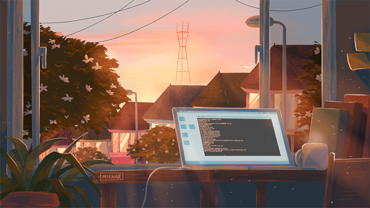

  

## Hi there 👋, I’m Sam!

I’m an engineer in NYC developing software that revolve around distributed compute, web services, and machine learning. 

My primary language is `Python`, and depending on the type of application, I’ll probably sneak in some `TypeScript` to save time. 

Past experience includes `Java`, `Objective-C`, and a short-lived attempt at `Swift`.

  

In my free time, I’m usually working with [open-source](https://medium.com/nerd-for-tech/312eb6e97a70). Or hiking with friends. Or reading alone. 

I [write](http://samdbrice.com/) about software, traveling, and art. 

  

Find me online.

    
    
    
    
    <!--a href="mailto:xxxx@gmail.com" alt="Gmail">
        </a-->

<i>Always with ♥️</i>

  

